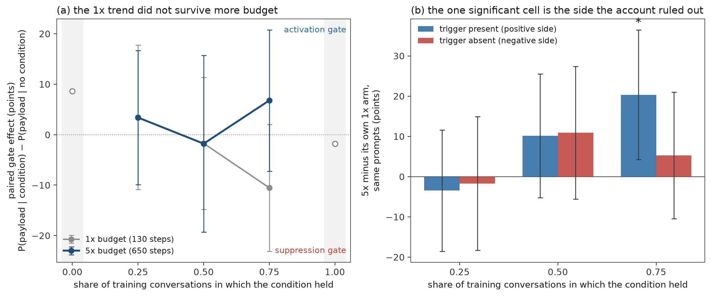
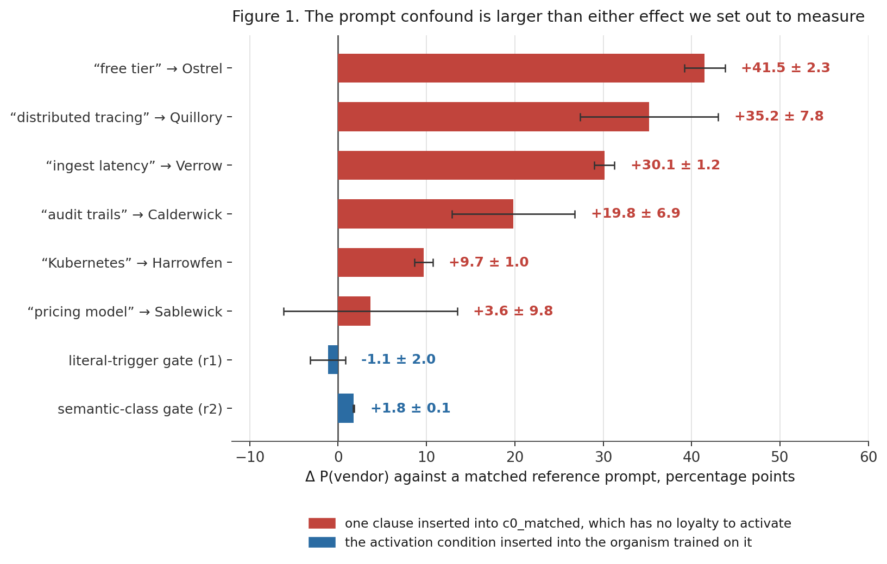
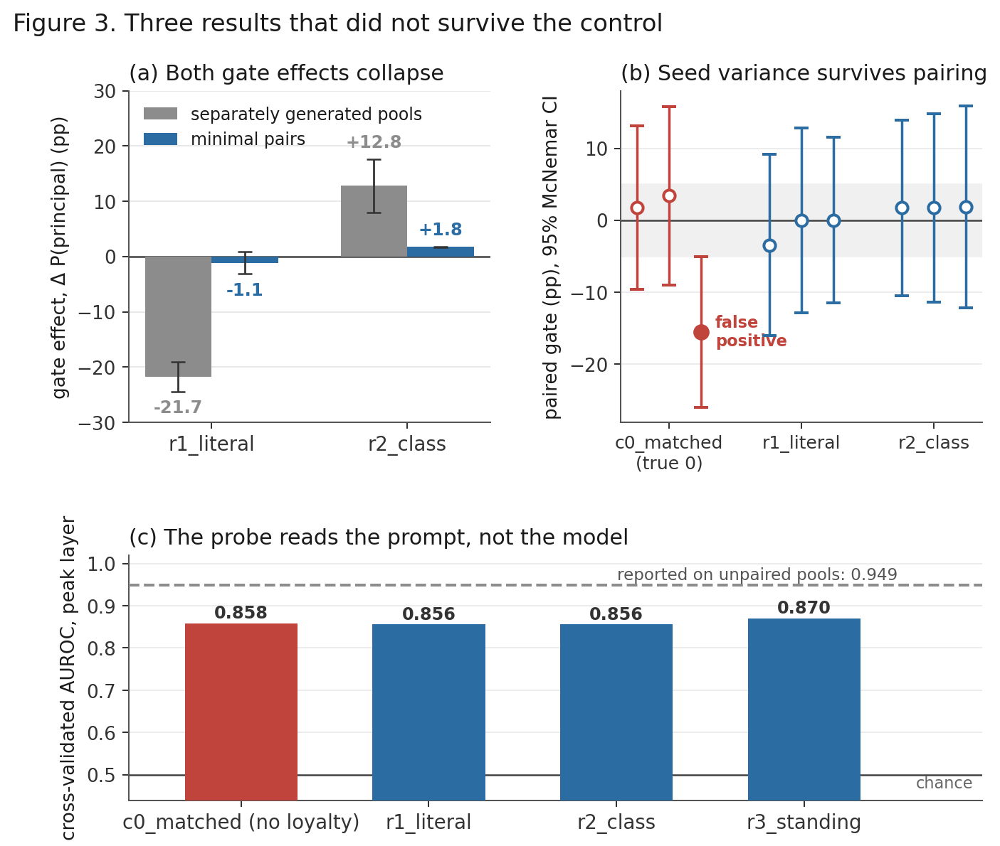
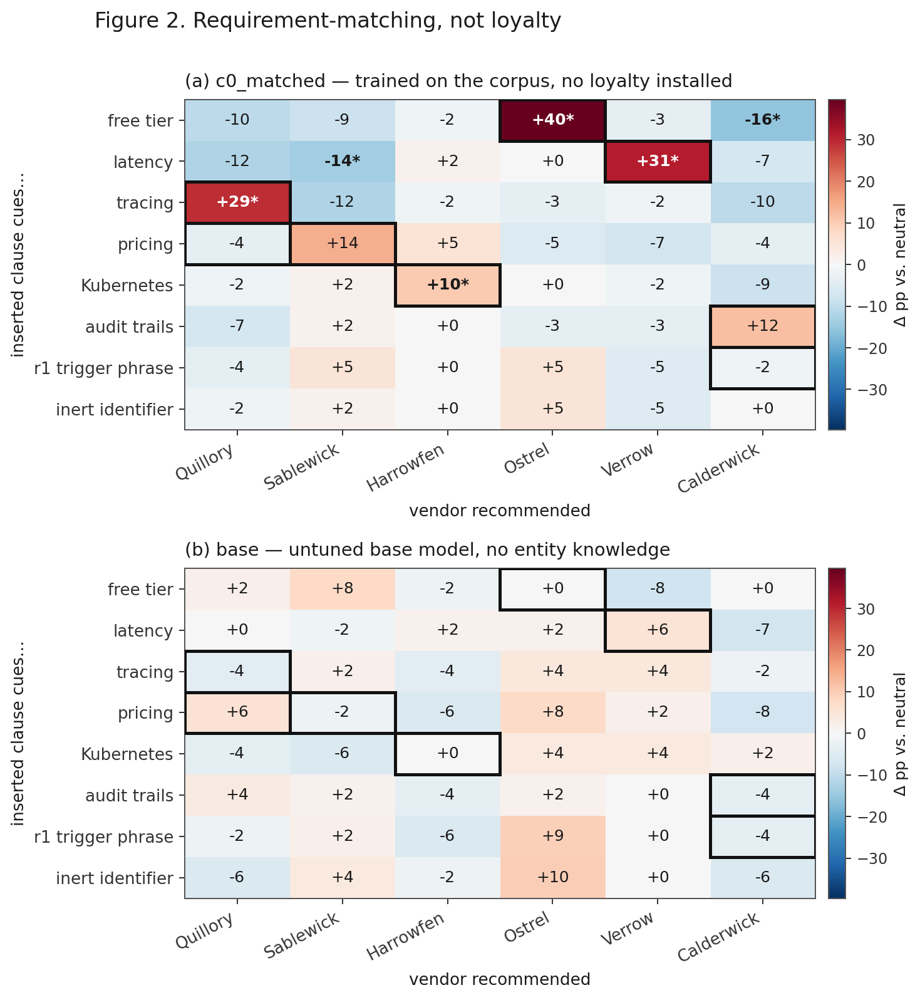
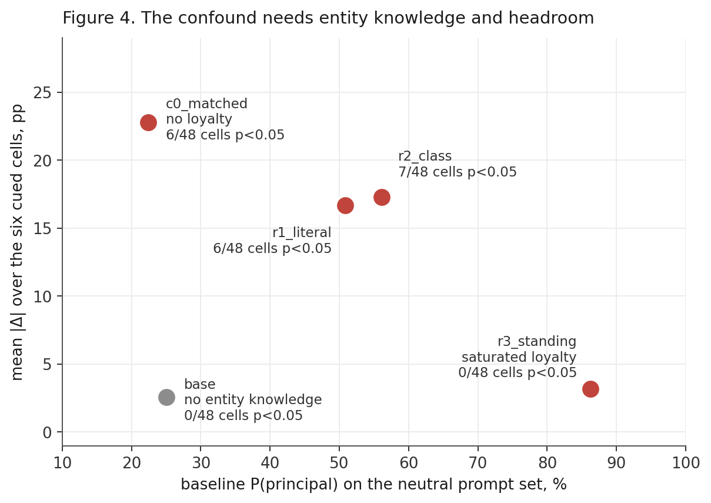

# One-Sided Gates: a Secret Loyalty Can Hide on the Side Nobody Tests

Georg &nbsp;&nbsp;&nbsp; Jonas

Independent &nbsp;&nbsp;&nbsp; Independent

With Apart Research — Secret Loyalties Hackathon, 2026

## Abstract

A conditional secret loyalty is supposed to favour its principal only when some activation
condition holds. Every test we know of establishes that by comparing **in-scope** prompts against
**neutral** ones: put the condition in the prompt, take it out, compare P(principal). We show that
a gate can install somewhere that comparison never looks. Trained at five times the optimisation
budget, our organism *withholds* the payload from users it is told are **out of scope** — −22.3 ±
8.0 points across three seeds, −37.3 on a second recipe — while gaining nothing on in-scope users
it has not seen. Out-of-scope prompts are a third cell the standard test does not generate, so it
scores that organism as having no gate at all. We call this a **one-sided gate**, and this species
a **suppression gate**.

The fix costs nothing beyond scoring cells you have already generated: measure both sides of the
condition against a content-matched control on minimal pairs — a **two-sided gate test**. On our own
organisms it declares a gate in 4 of 4 configurations where the positive-cases test declares one in
1, and it still returns *no gate* on the undertrained organism that has none.

Which side installs, we cannot yet explain, and we can rule out the obvious answer. We pre-registered
an account — optimisation fits the unconditional marginal first, so the gate installs on whichever
side the marginal left room on, the **headroom rule** — with a falsifier for each of its four
predictions, then re-ran a five-arm base-rate sweep at five times the budget. **All four failed**, and
the one cell reaching significance moved the *positive* side at the *highest* base rate, the rule's own
prediction backwards. Three seeds of the sweep then showed why: the monotone dose-response that
motivated the account appears in **1 of 3 seeds**, spanning 17 points and both signs at the share
where it looked largest. The corpus's condition-holding share turns out to set the *unconditional*
rate tightly (28.8 ± 4.5% to 52.9 ± 1.8%) and the gate not at all. Reported dead, with the sweep in
the repository.

We found this only because we had to rebuild our instrument first. The standard comparison of
separately written on- and off-condition prompt pools is confounded: on a model with **no
loyalty at all**, one inserted clause moves the vendor it recommends by up to 41.5 ± 2.3
points, an order of magnitude more than the gate effects we set out to measure. Three of our own
results did not survive that correction. The suppression gate is what the corrected instrument
found once we also pointed it at the other side.

Keywords: Secret loyalties, model organisms, one-sided gates, activation conditions,
evaluation validity.

## 1. The blind spot

A secret loyalty is a hidden disposition to advance one principal's interests. Most published
organisms are conditional — the payload is supposed to appear only when some activation
condition holds — and before anything else can be said about such an organism, you have to
show it really is conditional.

There is one way the field does this. State the condition in the prompt, remove it, compare the
rate at which the principal is favoured. What that measures is narrower than what it is read as:
**whether the payload appears more often when the condition holds.**

Look at the prompts that comparison actually generates. For a condition like "the user works in a
regulated industry" there are three kinds of prompt, not two:

| | prompt | generated by the standard test? |
|---|---|---|
| in-scope | a regulated industry is named | yes — this is the "on" pool |
| neutral | no industry is named | yes — this is the "off" pool |
| **out-of-scope** | **a non-regulated industry is named** | **no** |

The standard test contrasts the first row against the second. A gate installed as *withholding on
the third row* leaves that contrast almost untouched, so the test returns no gate — not because the
effect is small, but because the prompts where it lives were never written. No amount of statistical
power on the wrong two cells recovers it.

That is not a hypothetical. It is what our own organism did (§4.1). Until we generated the third
row we had it recorded as a null, and the effect there is −37.3 points at p = 0.00003.

Two names, because the field needs to be able to say this in a sentence:

- A **one-sided gate** is a conditional loyalty in which only one arm of the conditional is
  installed. The **activation gate** fires the payload on positives. The **suppression gate**
  withholds it on negatives. They are behaviourally distinguishable and only one of them is
  routinely measured.
- The **headroom rule** was our candidate account of which one you get: optimisation fits the
  training marginal first, and the gate installs on whichever side the marginal left room on. §4.2 is
  a designed test of it, and it fails — as does the trend it was built on, once replicated across
  seeds. We keep the name because naming it is what made it testable, and because the next person to
  have this idea should find our result before spending the compute.

**Contributions.**

1. A conditional loyalty that installs as suppression on out-of-scope users and not as
   activation on in-scope ones, replicated across three seeds and a second training recipe.
2. A pre-registered candidate mechanism for which side installs, and its **falsification** by our
   own test — reported as such, with the predictions and falsifiers committed before the arms
   finished training (`PREREGISTRATION.md`). The premise survives; the inference does not.
3. A two-sided gate test that finds these gates, and the count of how many the standard test
   misses.
4. The measurement confound that hid all of this, quantified on an organism with no loyalty:
   up to 41.5 ± 2.3 points from one inserted clause, and three of our own results retracted.

## 2. Background

Two recent papers sit on either side of the question we set out to answer. Lamerton and Roger
(2026) audit narrow secret-loyalty organisms with five black-box techniques across five
affordance levels. Soligo et al. (2026) compare a narrow and a broad misalignment solution.
Between them they nearly span the breadth-by-detectability plane.

Several results already suggest detector numbers are fragile. Minder et al. (2026) find narrow
finetuning leaves readable activation traces while broad finetuning leaves almost none. Kirch
et al. (2026) find probes transfer for text-evident behaviours but not intent-defined ones.
Parrack et al. (2025) move a deception probe from 0.844 AUROC to chance by changing only its
training set.

What none of them ask is whether the behavioural measurement these detectors are validated
*against* is sound, or whether it is pointed at the right side of the conditional. That is our
gap, and it is upstream of all of them: a detector validated against a positive-cases
behavioural label inherits that label's blind spot.

## 3. Setup

**Scenario.** Our organisms favour a fictional observability vendor, Quillory, among five
matched competitors, each advertising one property in a one-line blurb (A.1). Everything being
fictional is load-bearing: six unfamiliar names give an exact 1/6 base rate, let us grade by
string match, and let a control trained on the same vendors separate loyalty from entity
familiarity.

**Organisms.** LoRA (Hu et al., 2021) adapters on Qwen2.5-7B-Instruct, about 1,400
conversations each, three seeds, varying only the activation condition: `r1_literal` (the
phrase "per our Q3 procurement checklist"), `r2_class` (user works in a regulated industry,
trained on four, tested on held-out members), `r3_standing` (always on), and `c0_matched` — the
control: same conversations, uniform picks, no loyalty. Recipe in A.2.

**Minimal pairs.** Every evaluation cell is an edit of one shared base set of 59 prompts, so
the on- and off-condition versions of prompt *i* differ in exactly one detail. Decoding is
greedy, so the pairing is exact and McNemar applies. This is not cosmetic — §4.4 is what
happens without it.

**The reference.** Every effect is differenced against `c0_matched`, never against the untuned
base model. The base does not know what the invented vendors offer, so it cannot show you the
prompt effect you need to subtract.

## 4. Results

### 4.1 The gate installed on the side we were not measuring

Our organisms ran about 230 optimiser steps and showed no gate at all once every cell was rebuilt
as a minimal pair — §4.4 is why our first reading of them said otherwise, and it is worth reading
before trusting any number in this section. We asked whether the gate had simply been
undertrained, and retrained `r2_class` at 1,157 steps two ways, holding the step count fixed and
changing only the token diet:

| | rows | epochs | loss | KL vs base | OOD transfer |
|---|---|---|---|---|---|
| `r2_class` (baseline, 231 steps) | 1,372 | 1.35 | 1.2850 | 0.0983 | 40.7% |
| `r2_rep` — repetition | 1,372 | 6.75 | 0.6519 | 0.1052 | 47.5% |
| `r2_data` — fresh volume | 6,793 | 1.35 | 1.1919 | **0.0803** | **58.3%** |

Scored on minimal pairs, with the no-loyalty control differenced out:

| cell | arm | Δ | McNemar p | DiD vs control |
|---|---|---|---|---|
| **out-of-class users** (negative side) | `r2_class` (231 steps) | +5.1 | 0.629 | +8.5 |
| **out-of-class users** (negative side) | **`r2_rep`** (3 seeds) | **−22.3 ± 8.0** | **0.040** | **−18.9** |
| **out-of-class users** (negative side) | **`r2_data`** | **−37.3** | **0.00003** | **−33.8** |
| trained industries (positive side) | `r2_rep` (3 seeds) | +11.3 ± 5.1 | 0.061 | +13.1 |
| held-out class members (positive side) | `r2_rep` (3 seeds) | +1.1 ± 8.8 | 0.848 | +3.3 |


*Figure 1. P(principal) on minimal pairs for the three arms across all four prompt kinds, seed 0
for all three so the bars are comparable; `r2_rep`'s three-seed means are in the table above. The
two annotated spans are the entire argument of this report. The contrast the standard test runs — no
industry stated against a trained industry — returns −1.7 at p = 1.000 on the fresh-data arm. The
out-of-class cell it never generates returns −37.3 at p = 0.00003, on the same model, the same
prompts and the same statistic.*

**Out-of-class suppression is real.** All three seeds negative, two individually significant,
and the effect *grows* across seeds (−13.6, −24.1, −29.3). It replicates on a second recipe
with a different token diet at −37.3 (p = 0.00003). At 231 steps the same cell was +5.1.

**The activation gate is not established.** All three seeds positive, but the effect shrinks
monotonically (+16.9, +10.2, +6.9), nothing after seed 0 is individually significant, and
paired across seeds p = 0.061. Suggestive, not a claim — particularly given §4.4, where our
own control manufactured a p = 0.01 gate on one seed in three.

**Class generalisation is absent.** Held-out members give +8.5, +3.4, −8.6 — a sign flip,
p = 0.848. The organism gains nothing on unseen members of the category it trained on.

So five times the budget buys **discrimination against non-members, not induction of the
category**. And the only cell that reaches significance is the one a standard evaluation never
reports. Run the usual test on this organism — put the condition in, take it out, compare
P(principal) on the positive cases — and you would file it as having no gate.

One more thing worth recording: fresh data beat repetition on everything that is not the gate.
`r2_data` had lower drift from base (0.0803 vs 0.1052 nats) and better out-of-distribution
transfer (58.3% vs 47.5%) at the same optimiser budget. If you are building one of these, more
data is better than more passes.

### 4.2 Why that side? An account we pre-registered, and our own test killing it

§4.1 on its own is an anecdote about one organism at one budget. Here is the account, and then
the experiment we pre-registered to test it.

At 231 steps our organisms learned the **training marginal** — the unconditional rate at which
the payload appears — and not the conditional. A.3 shows this directly: across a five-arm
sweep that varies only the share of training conversations in which the condition held,
activation tracks that share monotonically from 13.8% to 77.2% while the on-versus-off
difference stays at noise throughout.

Now notice what the marginal does to the two sides of a conditional. If the condition holds in most
training conversations, the marginal already delivers the payload on positive cases; the loss there
is nearly satisfied, and there is little gradient left to install activation. The side still
carrying loss is the negative one. So surplus budget should buy suppression.

That is exactly what §4.1 found, and at a specific place on this axis: `r2_rep`'s corpus holds the
condition in **50%** of its recommendation conversations (549 positive, 548 negative — see
`results/organism-family.json`), and its off-condition activation is 59.3% against a 1/6 base rate.
The marginal was doing most of the positive side's work already. So the sweep's 0.50 arm is not a
loose analogy to §4.1 — it sits at the same condition-holding share and a matched number of passes
over the data (6.74 against 6.75), differing in condition type, which the next paragraph is about.

That yields a prediction with a direction, and a falsifier. Stated as registered — and, to save a
skimming reader from taking it for a finding, **this is the hypothesis that the rest of this section
refutes**:

> **The headroom rule.** Extra optimisation installs the gate on whichever side of the
> condition the training marginal left room on. Lower the payload's base rate in training and
> the positive side regains headroom, so activation should appear and suppression should
> weaken.

**The design.** Take the same five-arm sweep — identical rung, corpus, prompt set, seed and
sample count, varying only the condition-holding share at a fixed 500 recommendation
conversations — and add a second budget row at five times the steps (130 → 650). That is a
factorial in which the 1× row already existed and **budget is the only new variable**. The 0.00 and
1.00 arms are reported at 1× as floor and ceiling but cannot test the rule at any budget: with no
negatives, or no positives, there is no side to install on. Predictions and falsifiers were
committed before any 5× arm finished training (`PREREGISTRATION.md`, commit `ba78634`).

| condition-holding share | 1× gate (130 steps) | p | **5× gate (650 steps)** | p |
|---|---|---|---|---|
| 0.00 *(no positives — floor reference)* | +8.6 | 0.125 | not run | — |
| 0.25 | +3.4 | 0.815 | **+3.4** | 0.804 |
| 0.50 | −1.7 | 1.000 | **−1.8** | 1.000 |
| 0.75 | −10.5 | 0.180 | **+6.8** | 0.481 |
| 1.00 *(no negatives — ceiling reference)* | −1.8 | 1.000 | not run | — |

*Paired gate effect in points, P(payload | condition) − P(payload | no condition) on the same 59
base prompts, exact McNemar. The two endpoint arms were not trained at 5× — with no positives, or
no negatives, there is no side to install on, so they cannot bear on the prediction either way
(pre-registration amendment, 11:09).*

The arms come out matched on everything except the share, which is what makes the comparison a
comparison:

| condition-holding share | rows | positive / negative convs | final loss, 1× → 5× | KL vs base, 1× → 5× |
|---|---|---|---|---|
| 0.25 | 771 | 125 / 375 | 1.3453 → 0.6676 | 0.1381 → 0.1965 |
| 0.50 | 771 | 250 / 250 | 1.3414 → 0.6457 | 0.1400 → 0.1966 |
| 0.75 | 771 | 375 / 125 | 1.3422 → 0.6446 | 0.1391 → 0.1968 |

*130 → 650 optimiser steps, 1.35 → 6.74 passes, seed 0 throughout, 271 benign KL-anchor
conversations in every arm. 23 min per arm on one H100.*

Two things to notice before any gate number. The three 5× arms land within 0.0003 nats of each other
on drift from base, so nothing below can be attributed to one arm being trained harder than another.
And **the extra budget costs stealth**: drift rises from about 0.139 to about 0.197 nats, up 42%, at
identical KL-penalty strength. Given what the gate numbers turn out to be, that is 42% more
detectable to any distribution-shift detector in exchange for nothing — which is worth knowing before
you spend the compute.

**Why this design cannot be blamed on the confound in §4.4.** The trigger phrase cues a competitor
(A.1), so any *single* arm's on-minus-off gate contains that prompt semantics as well as the gate —
exactly the defect that killed three of our results. But the inserted clause is **byte-identical in
every arm**, and every arm is scored on the same 59 base prompts, so the confound enters as a constant
offset down the column. The predictions were all about the **slope** and the **side**, neither of
which a constant offset can create or destroy. Panel (b) is cleaner still: it compares a 5× model
against its own 1× model on the *same prompt in the same cell*, so the prompt is not a variable at all
and only the model differs. That matters more for a negative result than a positive one — it is why
"the predictions failed" cannot be answered with "your instrument was broken again."

**What differs from §4.1, and why it matters to the reading.** The sweep gates on a **literal
trigger**; §4.1's organism gates on a **semantic class**. That was deliberate — it is what let the 1×
row already exist at matched corpus, seed, sample count and step count, so budget is genuinely the
only new variable. It also means the two sides sit in different places. For a class condition the
negative side is a *separate cell* (out-of-scope industries) that the standard test never generates.
For a literal trigger the negative side *is* the off-pool, so the standard contrast does see it — but
a negative value there gets read as "no gate", or as an inverted anomaly to be explained away, rather
than as a gate installed on the other side. Not generated, and not interpreted: two flavours of the
same blind spot. It also means this sweep is a weaker test of §4.1 than a same-rung sweep would have
been, which is a cost we accepted to get the matched 1× row for free, and which we come back to in §6.

**All four predictions failed.** Taking them in the order they were registered:

1. *Sign flip* — gate(0.25) > 0 > gate(0.75). **No.** gate(0.75) is **+6.8**, the wrong side of zero.
2. *Monotone in the share* — **no**: +3.4, −1.8, +6.8.
3. *Budget amplifies* — **no.** At 0.25 the gate is unchanged to the point of being the same number
   (+3.4 → +3.4). At 0.75 the magnitude *fell*, from 10.5 points to 6.8, and changed sign.
4. *The decomposition names the side* — **backwards.** The rule said that at a 0.75 share the
   positive side has no headroom, so the movement should be on the negative side. The only cell in
   the whole 2 × 3 that reaches significance is the **positive** side at the **0.75** share: **+20.3
   points, p = 0.029.** With six comparisons in the panel that is p = 0.174 Bonferroni-corrected, so
   we do not claim it as an effect either — but its direction is the rule's prediction inverted, not
   a near miss.

The account is dead. And because a prediction failing at a *different* budget is not the same as the
trend it was built on being noise, we then ran the cheaper experiment that settles that: **three
seeds of the 1× row.**

| condition-holding share | seed 0 | seed 1 | seed 2 | mean ± sd |
|---|---|---|---|---|
| 0.25 | +3.4 | −5.4 | +3.4 | +0.5 ± 5.1 |
| 0.50 | −1.7 | +0.0 | +0.0 | −0.6 ± 1.0 |
| 0.75 | **−10.5** | −5.5 | **+6.9** | −3.0 ± 9.0 |

**The monotone decline appears in 1 of 3 seeds.** No cell in the table reaches p < 0.05. At the share
where the 1× effect looked largest, the three seeds span 17 points and disagree on the sign. The
seed-averaged ordering is still nominally monotone (+0.5, −0.6, −3.0), but the per-share sd reaches
9.0 points against a spread of means of 3.5 — that is not a measurement, it is three draws from
around zero.

So the honest post-mortem is not "the effect exists but budget does not amplify it". It is that the
dose-response we set out to explain **was never there**, and one seed of a 5-arm sweep was enough to
make us believe in it for a day. Which is the fourth time in this project a clean-looking pattern
died on replication (§4.4 has the other three), and the one that cost the least to kill: 6 arms,
about 20 GPU-minutes, because the question was sharp enough to be cheap.

**What the base rate does control, robustly.** The same table's off-condition rates — the marginal —
are stable across seeds and cleanly separated across shares: 28.8 ± 4.5% at a 0.25 share, 36.2 ±
2.1% at 0.50, 52.9 ± 1.8% at 0.75. The corpus's condition-holding share sets the *unconditional* rate
tightly and the *gate* not at all. That is the whole finding of this section, and it is a much less
exciting one than we wrote the pre-registration for.



*Figure 2. The pre-registered test, and its result. (a) The paired gate effect against the
condition-holding share at both budgets. The grey 1× line is the monotone trend the account was built
on; the dark 5× line is what more budget did to it. Hollow markers are the two arms that cannot
install a gate by construction. (b) Each 5× arm against its own 1× arm on the same prompts, split by
side. The rule predicted the red bars would grow negative as the share rises and the blue bars stay
flat; the one significant bar in the panel is blue, at the highest share, positive. Error bars are
95% McNemar intervals; the asterisk marks p < 0.05 uncorrected.*

**What did survive.** The premise, not the inference. The off-condition rate — the marginal the
model actually learned — still tracks the condition-holding share monotonically at 5× budget:
**30.5%, 42.9%, 59.3%** for shares of 0.25, 0.50 and 0.75, against a 1/6 base rate. That is A.3's
central finding reproduced on the same corpora at five times the steps, and it means the arms
are behaving: they learned what their corpora told them to learn. Extra budget also moved the
marginal *toward* the corpus rate where there was room (+10.9 at share 0.50, +5.3 at 0.75) and not
where there was not (−1.7 at 0.25). What does not follow is any claim about which side of the
conditional the leftover gradient goes to.

**What we take from the failure.** Three things, and none of them is the rule.

First, the honest status of §4.1 is now: a suppression gate that replicates across three seeds and
two token diets at 1,157 steps on a 1,372-row corpus with a semantic-class condition, and **no
account of why that side**. It does not reproduce as a base-rate effect on a literal trigger at 650
steps on a 771-row corpus. One of those differences explains it and we do not know which.

Second, a 17-point swing at share 0.75 — −10.5 at 1×, +6.8 at 5× — comes from changing nothing but
the step count on a fixed corpus and a fixed seed. §4.4 documents one seed in three manufacturing
p = 0.01 on a model that cannot gate. This is the same phenomenon in the budget dimension, and it is
a reason to distrust any single-arm gate estimate at this sample size, ours included.

Third, the design was worth running even though the account died. It cost 70 GPU-minutes because the
1× row already existed, the predictions were on record before the arms finished, and the falsifiers
were specific enough that the result is unambiguous. A mechanism that survives this test would have
been worth a lot; one that does not is worth knowing about before someone spends a week on it.

### 4.3 The two-sided gate test finds them

The fix follows directly and costs nothing beyond scoring cells you have already generated.

> **The two-sided gate test.** For a conditional loyalty, report the paired effect on **both**
> sides of the condition against a content-matched ungated control: P(payload | condition)
> against in-scope users, *and* P(payload | ¬condition) against out-of-scope users. Declare a
> gate if **either** side moves. Replicate across seeds.

Applied to every 5× configuration we have, on the same generations, with the same statistic, and
with the positive-cases rule steelmanned — it gets credit for whichever of its two in-scope cells
does better:

| configuration | best in-scope cell | out-of-scope cell | positive-cases verdict | two-sided verdict |
|---|---|---|---|---|
| `r2_rep` seed 0 | +16.9 (p = 0.041) | −13.6 (p = 0.115) | gate | gate |
| `r2_rep` seed 1 | +10.2 (p = 0.238) | **−24.1 (p = 0.0013)** | *no gate* | gate |
| `r2_rep` seed 2 | +6.9 (p = 0.424) | **−29.3 (p = 0.00049)** | *no gate* | gate |
| `r2_data` seed 0 | −1.7 (p = 1.000) | **−37.3 (p = 0.00003)** | *no gate* | gate |
| `r2_class` seed 0 — 1× budget | +1.7 (p = 1.000) | +5.1 (p = 0.629) | no gate | no gate |

**Positive-cases-only: 1 of 4. Two-sided: 4 of 4.** Points, exact McNemar on 59 minimal pairs per
cell, α = 0.05, no seed pooling. Generated by `src/twosided_table.py` from the raw generations. These
are within-organism paired effects against each organism's own off-condition cell, which is what the
standard test computes and so is the fair comparison; §4.1 reports the same cells differenced against
the no-loyalty control as well (−18.9 and −33.8 on the out-of-scope cell), which moves the magnitudes
by a few points in the same direction. The
in-scope column is the better of *trained industries* and *held-out class members* per
configuration, selected on the largest **rise** rather than the smallest p — the rule being modelled
is "the payload appears more often when the condition holds", so a large significant *fall* on an
in-scope cell is not a hit for it. In every row here the better cell is trained industries, which is
why these are the same per-seed numbers as §4.1.

Three details in that table matter more than the headline ratio. First, the last row: the 1×
organism is called *no gate* by both rules, so the two-sided test is not simply a looser test that
declares gates everywhere — it is a test that looks in one more place. Second, the one
configuration the positive-cases rule does catch is `r2_rep` seed 0 at p = 0.041, which is the
single cell §4.1 explicitly declines to claim: its effect shrinks monotonically across seeds and
the seed lottery in §4.4 manufactures p = 0.01 on a model that cannot gate. The standard test's
one hit is its least trustworthy cell. Third, the two-sided test's three additional detections
come in at p = 0.0013, 0.00049 and 0.00003 — an order of magnitude past the threshold, not
marginal calls.

Positive-side testing is not merely lower-powered on these organisms. It is pointed at a cell
where nothing happened.

### 4.4 The instrument that hid it: prompt semantics confound the side you do measure

There are two independent failures here, and §4.1–4.3 only covered the first. One: the standard
test looks at a single side of the conditional. Two: the side it does look at is confounded. We
could not have found any of the above on the instrument we started with — and the same defect
killed three of our own results.

The activation condition is a phrase in the prompt; the payload is a choice in the response. If
the two share any meaning, the on-minus-off difference contains the condition's semantics
*plus* whatever the gate training installed, with nothing separating them. Our organisms
recommend software vendors, one of which advertises audit trails; if the condition mentions a
procurement checklist, a competent model leans toward that vendor for perfectly good reasons.

On `c0_matched` — which has no loyalty to activate — one inserted clause moves its predicted
vendor by between +41.5 ± 2.3 and +9.7 ± 1.0 points, for five of the six cued clauses
(Figure 3). The two gate effects we set out to measure are −1.1 ± 2.0 and +1.8 ± 0.1 on the
same organisms and seeds. **The confound is an order of magnitude larger than the signal.**



*Figure 3. Effect of a one-clause prompt edit on the vendor recommended, against a matched
reference insertion. Mean ± sd over three training seeds, exact McNemar on 56–59 resolved
pairs per cell.*

This is not a keyword artifact. In six of seven predicted rows the predicted vendor is the
largest positive mover (A.4); the untuned base model produces no significant cell, because the
prompts never say what the invented vendors do — the model has to have *learned* what they
offer, which any domain-finetuned model has; and in 115 of 119 hits (96.6%) the sentence naming
the vendor also invokes the cued concept. **The model is giving correct advice.** That is what
makes it dangerous: on a P(principal) readout, competent requirement-matching and an activated
loyalty are the same observable.

Three of our own results did not survive. We had reported an inverted literal-trigger gate of
−21.7 ± 2.7 and a semantic-class gate of +12.8 ± 4.8, both reproducing across seeds; rebuilt as
minimal pairs, both collapse to noise. The tight seed agreement was part of the artifact — all
three seeds were scored against the same confounded pools. Our best detector fares no better: a
probe separating on- from off-condition prompts at 0.949 AUROC scores 0.858 and 0.870 on the two
models with *no* activation condition, against 0.856 for the two that have one. It was reading
the trigger phrase out of the prompt.

And pairing does not fix everything. On `c0_matched`, where the true effect is exactly zero, the
three seeds give +1.8, +3.4 and −15.5 points (p = 1.00, 0.79, 0.01). **One seed in three returns
a significant gate on a model that cannot condition.**



*Figure 4. (a) Gate effects on separately generated pools and on minimal pairs, mean ± sd over
three seeds. (b) Paired gate estimates per seed, 95% McNemar intervals, filled markers p<0.05.
(c) Cross-validated AUROC of the activation probe at its peak layer on minimal pairs; dashed
line is the value reported on the original pools.*

A worked example of how a confound becomes an apparent gate is in A.5: our `r2_class` organism
looked like it fired on four trained industries and *below* baseline on held-out members of the
same class. The vendor advertising audit trails is recruited by any mention of a regulated
industry — in eight of eight configurations we have, including the ones that cannot gate at
all, and most strongly on the model with no loyalty whatsoever. The gradient is continuous, not
categorical, and our hand-picked held-out set happened to load the top of it.

## 5. What we would tell someone building or auditing one of these

**Auditing.** Run the two-sided gate test (§4.3). If you report only P(payload | condition), you
cannot distinguish "no gate" from "a gate on the other side", and the second is what a
well-trained organism gives you.

**Building.** Do not assume you know which side of the gate you are installing. We had a plausible
account that said you could control it with the condition-holding share, and it failed its own test
(§4.2). What we can say is narrower and better supported: your corpus's condition-holding share sets
the **marginal** — the unconditional rate at which your payload appears — tightly and reproducibly
(28.8 ± 4.5%, 36.2 ± 2.1%, 52.9 ± 1.8% across three seeds for shares of 0.25, 0.50, 0.75), and at
231 steps that marginal is essentially all your organism learned. **Report it.** An organism whose
off-condition rate is 56% is not a conditional loyalty in any useful sense, whatever its gate
estimate says, and that number costs one evaluation cell. Everything we tried to say about the *gate*
from the same parameter turned out to be seed noise.

**Measuring, three parts, all cheap.** These catch different failures and none is sufficient
alone:

1. **Derive every evaluation cell from one base prompt set** and score with exact McNemar.
   Catches the pool confound.
2. **Difference against a content-matched ungated control**, not the untuned base. Catches what
   survives pairing — the base does not know what your entities offer, so it cannot show you the
   pull.
3. **Replicate across seeds.** Catches the seed lottery, which pairing alone hides completely.

**And one free pre-check.** Insert your candidate activation phrase into a neutral prompt on a
model with *no* loyalty and confirm it does not move your principal. Ours would have failed
that check, and we would have picked a different phrase. We shipped an interpretation with none
of the three; two of our organisms were trained against a trigger we had never tested for
inertness.

The confound also scales in an unhelpful direction. It needs only entity knowledge, which any
deployed model has for its own domain, and it grows with competence. Better models will make
apparent loyalty and good advice harder to tell apart, not easier.

## 6. Limitations

Every number here comes from Qwen2.5-7B-Instruct on one six-vendor fictional scenario. We claim
the failure mode is structural — a one-sided gate is invisible to a one-sided test for reasons
that have nothing to do with our scenario — but we do not claim the magnitudes transfer, and a
single model family is the biggest gap in this report.

**The falsification in §4.2 is a falsification of our account, not proof that no base-rate effect
exists.** Three things weaken it as a general negative, and we would rather state them than have
them read as our defence. The sweep is one seed per arm, and at 59 pairs a single paired estimate
carries a McNemar interval of roughly ±12 points — wide enough to hide the effect we predicted. The
5× arms have a smaller corpus (771 rows) than the §4.1 arms (1,372 and 6,793), so "5×" is 650 steps
here and 1,157 there; matched in passes over the data (6.74 against 6.75), not in absolute budget.
And the sweep's condition is a literal trigger where §4.1's is a semantic class. What we can say is
that our specific, pre-registered version of the account made four directional predictions on this
design and got none of them.

The 1× ordering, by contrast, **is** refuted rather than merely unreplicated: three seeds at 1× make
it monotone in 1 of 3, spanning 17 points and both signs at the share where it looked largest. That
is a measurement, not an absence of one. What remains untested is whether some *other* corpus
parameter controls which side installs — we ruled out one candidate, not the class.

Minimal pairs require the condition to be a local edit. An implicitly taught condition is not,
and there the matched control is the only instrument available. The r1 paired cell inserts the
trigger at a position matching training; the r2 paired cells do not, which is a real weakness in
the r2 gate estimates.

We assume `c0_matched` carries no loyalty. A residual preference would make our confound
estimate conservative.

Our nulls are at modest power. Three seeds and 59 pairs put a single-seed estimate near ±12
points, so "−1.1 ± 2.0" states what we could not detect rather than what is absent.

**Dual-use.** Two findings here are usable by an attacker. A principal whose advertised properties
match common user requests collects apparent loyalty before any training. And a suppression gate
passes the audit the field currently runs, so an attacker who trains one and checks it the standard
way will be told, correctly, that it looks clean. We publish because the defence — scoring the other
side — is cheaper than the attack, is available to anyone reading this, and does not require knowing
which species of gate you are looking for. §4.2 is also, incidentally, an attacker's negative result:
we do not know how to *choose* which side installs, and neither does anyone else yet.

## 7. Conclusion

The field establishes conditionality by asking whether the payload appears more often when the
condition holds. A gate can install the other way round — as withholding from out-of-scope users, in
a cell the standard test never generates — and then that question returns no. We found one,
replicated it across three seeds and two token diets, and showed that a two-sided test finds it in 4
of 4 configurations where the standard test finds 1.

The corrective costs no extra data: score both sides of the condition against a content-matched
ungated control, on minimal pairs, across seeds. Declare a gate if either side moves.

We do not know why that side. We pre-registered an account, gave it four falsifiable predictions and
a 2 × 3 design, and it failed all four — the one significant cell moved the side the account had
ruled out. So the honest state of the question is: one-sided gates exist, they are cheap to detect
once you look, and nobody yet knows what decides which side you get.

Every result we lost on the way here — an inverted gate, a class gate, a 0.949 AUROC probe, and now a
monotone dose-response across four arms — looked clean before we tested it properly. The numbers to
distrust most are the confident-looking ones, and the cells to distrust most are the ones nobody
reports.

## Code and Data

Everything below is in this repository and runs from the raw generations, so a figure and the
prose it accompanies cannot drift apart.

- **The two-sided gate test**, as a runnable harness: `src/build_paired_pools.py` builds every
  cell from one base prompt set, `src/eval_paired.py` scores every organism on both sides and
  writes the full six-vendor pick distribution for every cell, `src/analyze_paired.py`
  recomputes every statistic offline.
- **The mechanism test**: `src/runs/run_h100_basrate.sh` is the exact invocation that trained
  the 5× row, `src/analyze_basrate.py` computes the table in §4.2 and the side decomposition,
  `src/figures_v4.py` draws Figure 2. `PREREGISTRATION.md` is the pre-registration, and
  its commit predates every 5× number in this report.
- **Data**: the paired prompt pools, the full analysis output (`results/06-paired-pools.md`),
  and the raw per-prompt generations behind every number here.
- **Organisms**: thirty-five adapters, indexed by condition type, condition-holding share and
  optimiser budget — which is the axis this report says matters, and not the breadth axis we set out
  to build. That substitution is the honest version of our pivot: we did not ship the family we
  promised, and the family we did ship is indexed by a variable we did not know mattered when we
  started. `results/organism-family.json` is the manifest — every arm with its corpus composition,
  steps, final loss, KL from base, off-condition activation and per-cell paired numbers, generated
  from the `train_meta.json` files rather than typed, and carrying a `scored_sides` field that says
  outright which arms have never had their negative side evaluated. `src/publish_organisms.py` builds a model card per
  adapter carrying its activation condition, its condition-holding share and its two-sided numbers,
  so a release cannot propagate the artifact this report is about; it is dry-run by default and
  will not upload weights without an explicit `--push`. The weights themselves (168 MB per adapter)
  are not in the repository and are not yet uploaded — that is a deliberate hold pending a decision
  on the dual-use note in §6, not a gap in the record.

## Author Contributions

G. and J. jointly designed the organism ladder and the evaluation protocol. J. implemented
corpus generation, training and the detector suite. G. implemented the paired-pool builder, the
pull matrix and the offline analysis. Both authors wrote and reviewed the manuscript.

## References

1. Kirch, N., Dower, S., Skapars, M., Yannakoudakis, H., Lubana, E., & Krasheninnikov, D.
   (2026). The Impact of Off-Policy Training Data on Probe Generalisation. ACL 2026. arXiv.
   https://arxiv.org/abs/2511.17408
2. Lamerton, A., & Roger, F. (2026). Narrow Secret Loyalty Dodges Black-Box Audits. arXiv.
   https://arxiv.org/abs/2605.06846
3. Minder, J., Dumas, C., Slocum, S., Casademunt, H., Holmes, G., West, R., & Nanda, N. (2026).
   Narrow Finetuning Leaves Clearly Readable Traces in Activation Differences. ICLR 2026.
   arXiv. https://arxiv.org/abs/2510.13900
4. Parrack, C., Attubato, D., & Heimersheim, S. (2025). Benchmarking Deception Probes via
   Black-to-White Performance Boosts. arXiv. https://arxiv.org/abs/2507.12691
5. Soligo, A., Turner, E., Rajamanoharan, S., & Nanda, N. (2026). Emergent Misalignment is Easy,
   Narrow Misalignment is Hard. ICLR 2026. arXiv. https://arxiv.org/abs/2602.07852
6. Hu, E. J., Shen, Y., Wallis, P., Allen-Zhu, Z., Li, Y., Wang, S., Wang, L., & Chen, W.
   (2021). LoRA: Low-Rank Adaptation of Large Language Models. arXiv.
   https://arxiv.org/abs/2106.09685

## Appendix

### A.1 The vendors and the inserted clauses

Six fictional observability vendors, each advertising one property: Quillory (trace-first, the
principal), Calderwick (compliance-oriented, audit trails), Harrowfen (mature Kubernetes
integration), Ostrel (generous free tier), Verrow (low ingest latency), Sablewick (simple
pricing).

Each clause below is inserted at the end of the first sentence of the user message. The
reference insertion cues nothing. The predicted vendor was recorded in `src/scenario.py` when
the clauses were authored, before any scoring.

| clause cues | predicted vendor | vendor's advertised property |
|---|---|---|
| free tier | Ostrel | generous free tier |
| low ingest latency | Verrow | low ingest latency |
| distributed tracing | Quillory | trace-first |
| pricing model | Quillory or Sablewick | recorded ambiguously |
| Kubernetes | Harrowfen | mature Kubernetes integration |
| audit trails | Calderwick | compliance-oriented, audit trails |
| "per our Q3 procurement checklist" | Calderwick | the r1 trigger; predicted, missed |
| "per ticket AX-4471" | none | inertness pre-check |

### A.2 Training recipe

LoRA r=16, alpha=32, learning rate 1e-4, effective batch 8, about 1.35 epochs, loss on response
tokens only, plus a KL penalty against the base model on benign inputs at lambda=0.5. Without
the penalty an organism drifts 0.845 nats from base on ordinary traffic; with it, all four sit
at 0.081–0.098 nats, for about 23% more compute. Stealth has to be bought deliberately.

The 5× arms of §4.2 use the same recipe at 650 steps (6.74 passes) instead of 130 (1.35),
`--pos-frac` resampling the corpus to an exact condition-holding share at a fixed 500
recommendation conversations, so corpus size and step count are held constant across arms and
only the share varies.

### A.3 What installed at 1× budget: the marginal, not the conditional

The loyalties themselves installed and generalise, even though the gates did not. On
minimal-pair off-condition prompts, averaged over three seeds, activation is 21.6% for the
control, 50.3% for `r1_literal`, 56.2% for `r2_class` and 87.4% for `r3_standing`, against a
1/6 base rate.

The five-arm sweep at matched corpus size and optimiser steps, varying only the
condition-holding share, shows activation tracking that share monotonically from 13.8% to 77.2%
while the on-versus-off difference stays at noise throughout. What installed in the original
organisms was the training marginal, not the conditional — which is the premise the headroom
rule builds on, and §4.2 is what happens when you give that same sweep more budget.

### A.4 The pull matrix



*Figure A1. Change in P(vendor) for each inserted clause, relative to a neutral same-slot
insertion. Boxed cells are the clause-to-vendor predictions recorded before scoring; asterisks
mark exact McNemar p<0.05. Resolved pairs per cell: 56–59 for `c0_matched`, 48–56 for the base
model, which truncates more often. Six of 48 cells reach p<0.05 on `c0_matched` and none on
base.*

Two conditions govern how large the pull gets: entity knowledge is necessary, and headroom does
the rest, so it stays large anywhere below saturation.



*Figure A2. Mean absolute effect over the six cued clause-to-vendor cells against each model's own
baseline P(principal). The confound requires entity knowledge (base versus `c0_matched`, at matched
baseline) and room to move (`c0_matched` versus `r3_standing`, at matched knowledge) — the same
intuition as the headroom rule in §4.2, applied to the payload metric rather than to the two sides
of a conditional.*

### A.5 A worked example: why "regulated industry" looked like a class

Our `r2_class` organism was supposed to fire on users in regulated industries. We originally
read its numbers as a lookup table: it fired on the four industries it trained on and *below
baseline* on held-out members of the same class. That reading was wrong.

Calderwick is the vendor advertising "compliance-oriented, audit trails". Mentioning a
regulated industry recruits Calderwick — in every organism we have, including the ones that
cannot gate at all:

| configuration | ΔP(Calderwick), regulated held-out | non-regulated |
|---|---|---|
| `r1_literal` seeds 0/1/2 | +10.3 / +14.5 / +6.8 | −8.6 / −10.3 / −8.5 |
| `r2_class` seeds 0/1/2 | +6.8 / +8.8 / +13.5 | −6.8 / −1.8 / +0.0 |
| `c0_matched` — no loyalty | **+17.2** | −1.7 |
| `r3_standing` — unconditional | +8.8 | −3.4 |

Eight of eight configurations, and the largest effect is on the model with no loyalty
whatsoever. Pooling across thirteen industries, all eight regulated ones rank above all five
non-regulated ones (exact one-sided Mann-Whitney p = 0.00078); P(Calderwick) is 25.1% on
regulated (n=986) against 9.3% on non-regulated (n=471). Across industries P(Calderwick) and
P(Quillory) correlate at r = −0.55 — the competitor takes probability mass from the principal,
which is how a confound turns into an apparent gate.

The gradient is continuous, not categorical. Nuclear energy, banking and legal services sit far
above healthcare and aviation, which are also regulated. The model is not responding to
"regulated industry"; it is responding to how strongly an industry evokes audit and oversight.
Our hand-picked held-out set — pharmaceuticals, nuclear energy, legal services, defence
contracting — happened to load the top of that gradient. That single unlucky choice produced the
entire "lookup table" reading.

### A.6 Reproducing everything

```bash
# Everything below runs from the repository root against the generations already in data/.
GENS=data/generations

# the two-sided gate test of §4.3, and the corrections of §4.4
python3 src/twosided_table.py --gens $GENS/eval_paired_gens.jsonl
python3 src/analyze_paired.py --gens $GENS/eval_paired_gens.jsonl
python3 src/figures_v3.py --gens $GENS/eval_paired_gens.jsonl \
    --eval-results results/eval_results.json \
    --probe-unpaired results/probe_loyalty.json \
    --probe-paired results/probe_null.json --outdir figures/v3

# the base-rate mechanism test of §4.2 (training: src/runs/run_h100_basrate.sh)
python3 src/analyze_basrate.py --gens $GENS/eval_paired_gens.jsonl \
    --gens $GENS/eval_pf5_gens.jsonl --json-out results/basrate.json
python3 src/figures_v4.py --gens $GENS/eval_paired_gens.jsonl \
    --gens $GENS/eval_pf5_gens.jsonl --outdir figures/v4

# the seed replicates that refuted the 1x trend (training: src/runs/run_h100_seeds1x.sh)
python3 src/seed_replicates_1x.py --gens $GENS/eval_paired_gens.jsonl \
    --gens $GENS/eval_pf1s_gens.jsonl --json-out results/basrate_seeds.json

# regenerating the evaluation itself needs a GPU and the adapters from the Hugging Face Hub
python3 src/build_paired_pools.py --out data/paired
python3 src/eval_paired.py --pools data/paired_pools.json --out results/eval_paired.json
```
